# Лабораторна робота №1 

---

## Завдання 1(б)
**Результат:**  
  
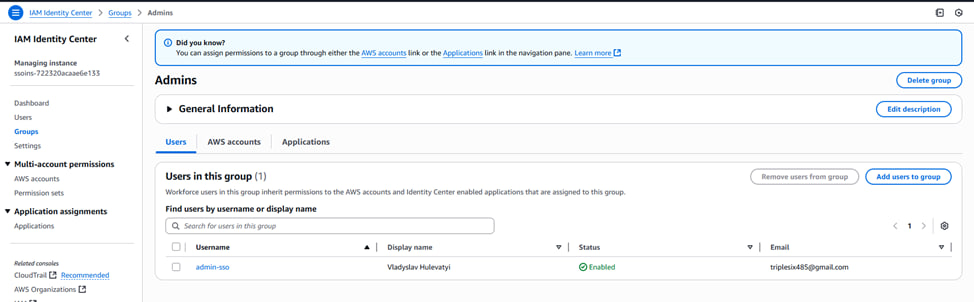

---

## Завдання 2
**Результат:**  
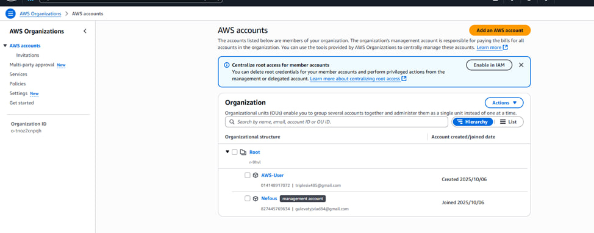

---

## Завдання 3
**Результат:**  
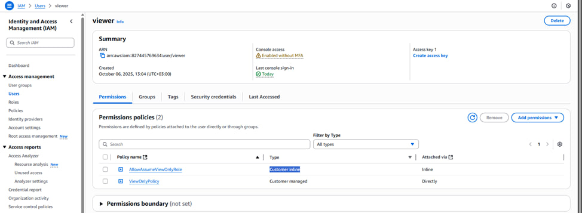  
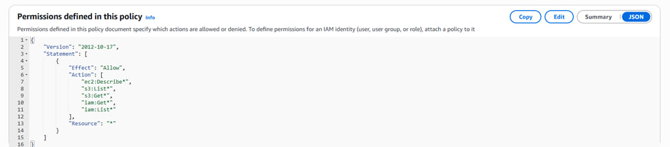

---

## Завдання 4
**Результат:**  
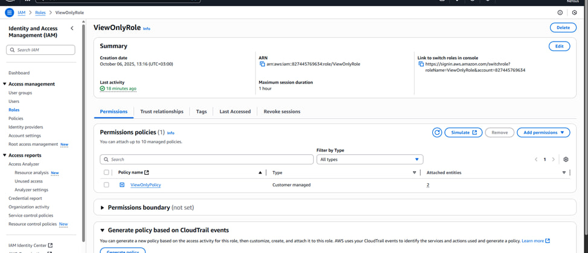  
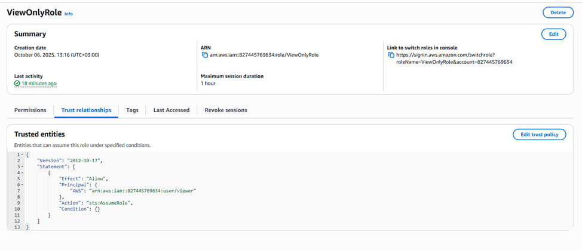

---

## Завдання 5
**Файл:**  
[Посилання](Resources/lab1-task5.yaml)  
**Результат:**  
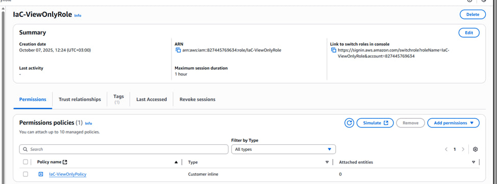
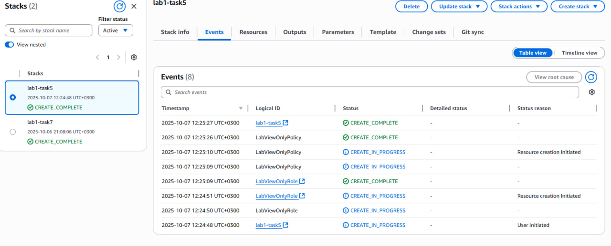  

---

## Завдання 6
**Результат:**  
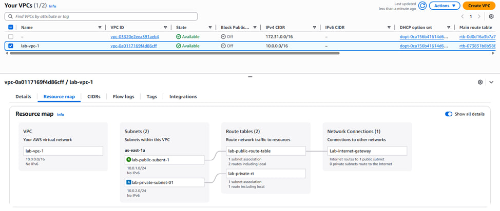

---

## Завдання 7
**Файл:**  
[Посилання](Resources/lab1-task7.yaml)  
**Результат:**  
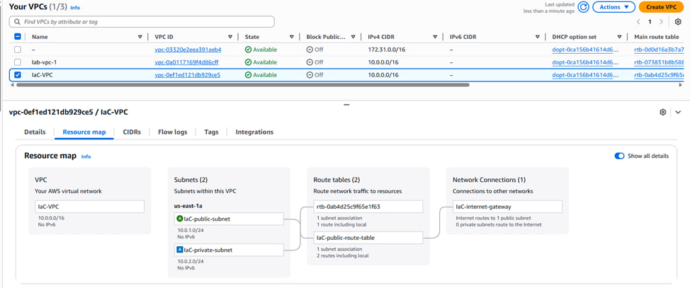 
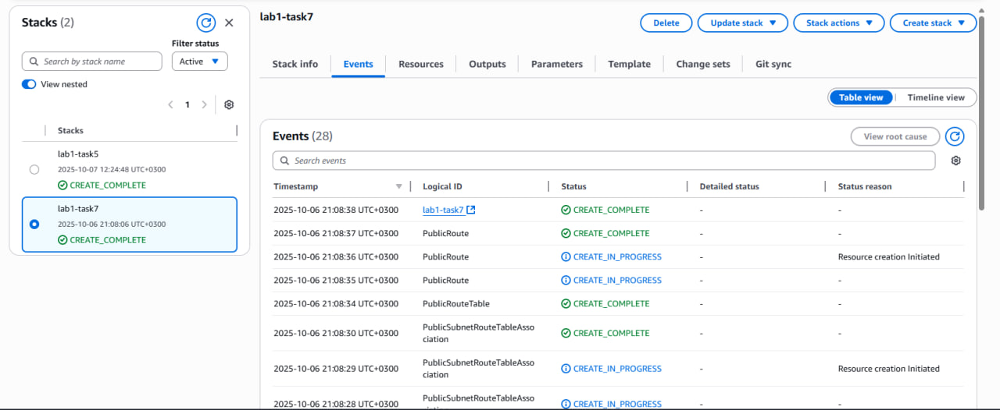

---

## Завдання 8
**Результат:**  
[Посилання](Resources/lab1-task8.md)

## Додатково 
- Усі скріншоти знаходяться в папці [`Screenshots`](Screenshots/).  
- Файли — у [`Resources`](Resources/).  

---

*** Роботу виконав студент групи КІ-22 Гулеватий Владислав ***